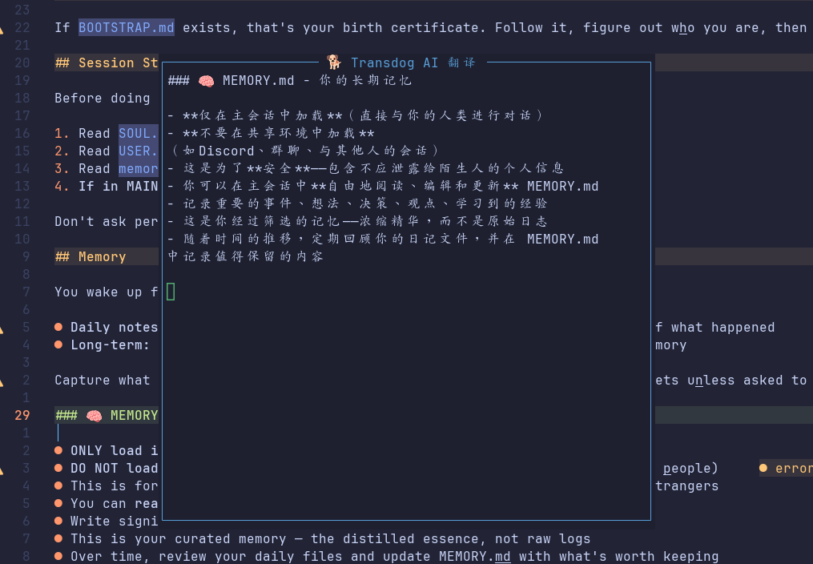
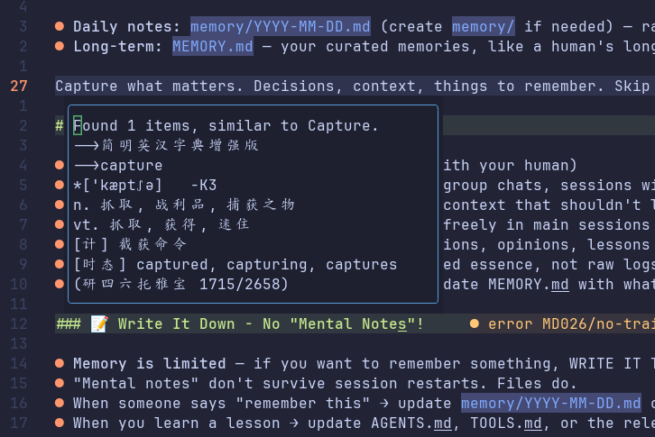

# transdog.nvim 🐕

一个专注于**离线翻译**的 Neovim 插件，基于 [sdcv](https://github.com/Dushistov/sdcv) 词典查词和 [Ollama](https://ollama.com) 本地 AI 翻译，无需网络，无需 API Key。




---

## ✨ 功能

- **词典查词**（sdcv）：光标下单词一键查词，浮窗显示释义
- **AI 段落翻译**（Ollama）：选中文本，用本地大模型翻译整段内容
- **流式输出**：翻译结果实时逐字显示，无需等待全部完成
- **lualine 状态指示**：翻译中 / 完成 / 错误状态直接嵌入底栏
- **完全离线**：所有翻译在本地完成，不依赖任何在线服务

---

## 📦 安装

### 依赖

- Neovim >= 0.10
- [sdcv](https://github.com/Dushistov/sdcv) 及至少一个 StarDict 格式词典
- [Ollama](https://ollama.com) 及一个翻译模型

**安装 sdcv：**

```bash
# Arch Linux / Manjaro
sudo pacman -S sdcv

# Ubuntu / Debian
sudo apt install sdcv

# macOS
brew install sdcv
```

**安装 Ollama 模型：**

```bash
ollama pull translategemma:4b
```

### lazy.nvim

```lua
{
  "IC-killer/transdog.nvim",
  lazy = false,
  opts = {},
}
```

---

## ⚙️ 配置

以下是所有可配置项及其默认值：

```lua
{
  "IC-killer/transdog.nvim",
  lazy = false,
  opts = {
    sdcv_cmd     = "sdcv",               -- sdcv 可执行文件路径
    ollama_cmd   = "ollama",             -- ollama 可执行文件路径
    ollama_model = "translategemma:4b",  -- 使用的 Ollama 模型
    stream       = true,                 -- 是否使用流式输出

    float = {
      border     = "rounded",  -- 浮窗边框风格
      max_width  = 120,        -- 浮窗最大宽度（字符数）
      max_height = 40,         -- 浮窗最大高度（行数）
      wrap_width = 100,        -- 自动换行宽度（字符数）
    },

    keymaps = {
      translate_word   = "<leader>tt",  -- 普通模式：sdcv 查词
      translate_ollama = "<leader>tt",  -- 可视模式：AI 翻译
    },
  },
}
```

---

## 🚀 使用

### 快捷键

| 模式 | 快捷键 | 功能 |
|------|--------|------|
| Normal | `<leader>tt` | sdcv 查词（光标下的单词） |
| Visual | `<leader>tt` | Ollama AI 翻译（选中内容） |

### 命令

| 命令 | 功能 |
|------|------|
| `:Transdog` | 普通模式查词 / 可视模式 AI 翻译 |
| `:TransdogWord` | 强制使用 sdcv 查词 |
| `:TransdogAI` | 强制使用 Ollama AI 翻译 |

### 浮窗操作

| 按键 | 操作 |
|------|------|
| `q` | 关闭浮窗 |
| `<Esc>` | 关闭浮窗 |

---

## 📊 lualine 集成

在 lualine 底栏显示翻译状态，在你的 LazyVim 配置里新建或修改 lualine 配置文件：

```lua
-- lua/plugins/lualine.lua
return {
  "nvim-lualine/lualine.nvim",
  opts = function(_, opts)
    table.insert(opts.sections.lualine_x, 1, {
      function()
        return require("transdog").lualine_status()
      end,
      cond = function()
        return require("transdog").lualine_status() ~= ""
      end,
    })
  end,
}
```

| 图标 | 含义 | 持续时间 |
|------|------|---------|
| 🐕 翻译中... | Ollama 正在翻译 | 翻译期间持续显示 |
| ✅ 翻译完成 | 翻译成功 | 5 秒后自动消失 |
| ❌ 错误信息 | 翻译失败 | 5 秒后自动消失 |

---

## 📖 sdcv 词典推荐

sdcv 使用 **StarDict 格式**词典，每本词典由以下三个文件组成：

```
词典名.ifo      # 元数据（词典名称、词条数等）
词典名.idx      # 索引文件
词典名.dict.dz  # 压缩后的词条内容
```

将解压后的词典文件夹放入 sdcv 的词典目录即可使用：

```bash
# Linux 系统全局目录
/usr/share/stardict/dic/

# 用户个人目录（无需 root 权限，推荐）
~/.stardict/dic/

# macOS（Homebrew 安装的 sdcv）
~/.stardict/dic/
```

验证词典是否加载成功：

```bash
sdcv -l          # 列出所有已加载的词典
sdcv hello       # 查询单词测试
```

---

### 推荐词典

#### 简明英汉字典增强版（首选推荐）

收词量最大的开源英汉词典，基于 BNC/COCA 语料库词频矫正，涵盖 324 万词条，并标注了考试大纲（四六级、托福、GRE 等）和柯林斯星级。

- 下载地址：[ECDICT Releases](https://github.com/skywind3000/ECDICT/releases)
- 下载文件：`ecdict-stardict-*.zip`（StarDict 格式，含音标）

```bash
# 下载并安装
wget https://github.com/skywind3000/ECDICT/releases/download/1.0.28/ecdict-stardict-28.zip
unzip ecdict-stardict-28.zip -d ~/.stardict/dic/
```

---

#### 懒虫简明英汉 / 汉英词典

轻量简洁，日常查词够用，适合追求低延迟的场景。

- 下载地址：[Internet Archive - StarDict 词典合集](https://web.archive.org/web/20140917131745/http://abloz.com/huzheng/stardict-dic/zh_CN/)
- 下载文件：`lazyworm-ec-gb.tar.bz2`（英汉）/ `lazyworm-ce-gb.tar.bz2`（汉英）

```bash
tar -xvjf lazyworm-ec-gb.tar.bz2 -C ~/.stardict/dic/
tar -xvjf lazyworm-ce-gb.tar.bz2 -C ~/.stardict/dic/
```

---

#### 朗道英汉 / 汉英字典

收词约 40 万，老牌词典，覆盖大量专业词汇。

- 下载地址：[Internet Archive - StarDict 词典合集](https://web.archive.org/web/20140917131745/http://abloz.com/huzheng/stardict-dic/zh_CN/)
- 下载文件：`langdao-ec-gb.tar.bz2`（英汉）/ `langdao-ce-gb.tar.bz2`（汉英）

```bash
tar -xvjf langdao-ec-gb.tar.bz2 -C ~/.stardict/dic/
tar -xvjf langdao-ce-gb.tar.bz2 -C ~/.stardict/dic/
```

---

#### CC-CEDICT（中英双解）

开源社区维护的中英词典，词条超过 11 万，持续更新，适合查汉语词汇的英文释义。

- 下载地址：[CC-CEDICT StarDict 格式](https://github.com/lxs602/Chinese-Mandarin-Dictionaries)

---

#### WordNet（英英）

普林斯顿大学出品的英英词典，按语义网络组织，适合深度理解英文词义。

- 下载地址：[Internet Archive - StarDict 词典合集](https://web.archive.org/web/20140917131745/http://abloz.com/huzheng/stardict-dic/English/)
- 下载文件：`WordNet.tar.bz2`

```bash
tar -xvjf WordNet.tar.bz2 -C ~/.stardict/dic/
```

---

### 同时使用多本词典

sdcv 会自动加载词典目录下的所有词典并合并输出结果，无需额外配置。如果想指定只使用某本词典：

```bash
sdcv -u "简明英汉字典增强版" hello
```

在 transdog.nvim 里可以通过 `sdcv_cmd` 固定使用特定词典：

```lua
opts = {
  sdcv_cmd = "sdcv -u '简明英汉字典增强版'",
}
```

---

## 🔭 路线图

- [x] sdcv 词典查词
- [x] Ollama 本地 AI 翻译
- [x] 流式输出
- [x] lualine 状态集成
- [ ] 翻译历史记录

---

## 📄 License

MIT
